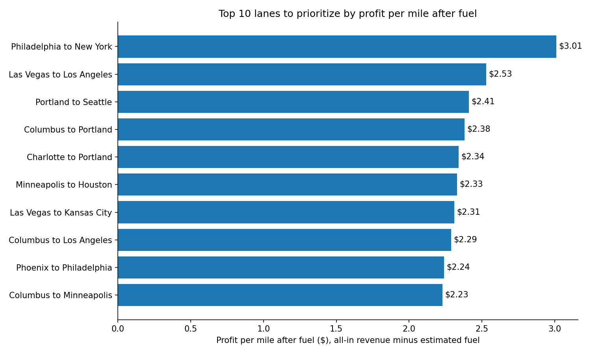
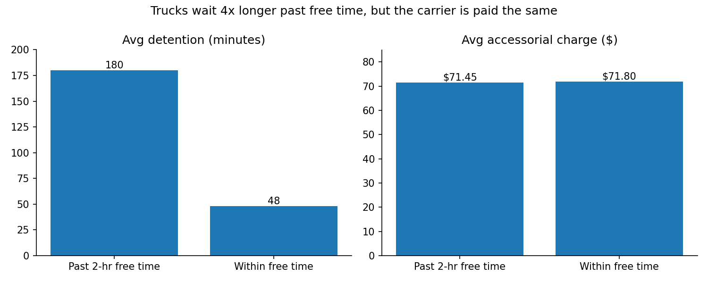
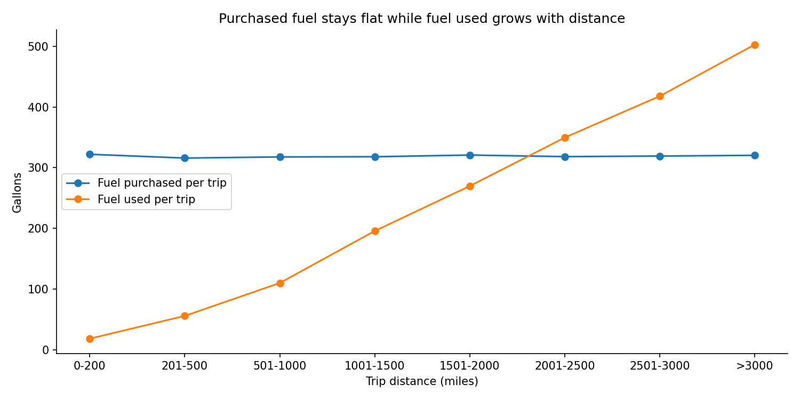

# Trucking Fleet Performance Analysis

A SQL and Python analysis of a trucking fleet's operations data (85,000+ loads,
58 lanes, 14 tables) to answer one question a carrier actually cares about:
**where is the fleet making money, and where is it losing money?**

I built this because I've run a trucking company. I was Acting President and
then VP of Business Strategy at my family's temperature-controlled freight
carrier, so I came to this data knowing which questions matter to a dispatcher
or an owner, and which numbers look wrong.

**Tools:** SQL (SQLite), Python (pandas, matplotlib), Jupyter

---

## Key findings

### 1. Which lanes to prioritize



- Philadelphia to New York leads all 58 lanes at **$3.01/mile** after fuel,
  followed by Las Vegas to Los Angeles ($2.53) and Portland to Seattle ($2.41).
- The top 10 is a mix of short regional and long cross-country lanes. Distance
  alone doesn't predict which lanes earn the most.
- Fuel cost is nearly identical on every lane ($0.60 to $0.61/mile), so the
  same 10 lanes lead before and after fuel. **Rates and accessorial charges
  decide lane profitability, not fuel.**
- Per-mile rankings don't tell the whole story: a 2,400-mile lane at $2.38/mile
  brings in far more total dollars per load than a 94-mile lane at $3.01/mile.
  Lane decisions need both views.

### 2. Detention isn't being billed



Shippers and receivers usually get about 2 hours of free time before detention
(time a truck waits at the dock) becomes billable.

- **44% of deliveries** run past free time, vs. 28% of pickups. Deliveries are
  also on time only 44.6% of the time (pickups: 66.7%).
- Loads past free time wait nearly **4x longer** (180 vs. 48 minutes on average),
  but their accessorial charges are the same ($71.45 vs. $71.80).
- The carrier is absorbing detention without getting paid for it: about
  **37,800 hours** past free time at delivery alone. At a typical $50 to $75/hour
  detention rate, that's roughly **$1.9M to $2.8M** that could have been billed.
  (The hourly rate is an industry assumption, not from the data.)
- **Recommendation:** enforce detention billing at receivers, starting with the
  facilities that hold trucks the longest.

### 3. Why fuel purchases don't match fuel used (root cause analysis)



To estimate fuel cost per trip, I first had to explain why the fuel data didn't
add up: estimated fuel cost came out about 30% below actual fuel purchases, and
only 286 of 76,939 trips matched within a gallon.

I tested three explanations:

| Hypothesis | Test | Result |
|---|---|---|
| Refrigerated trailers burn extra fuel | Compare gap for Dry Van vs. Reefer | Ruled out (0.697 vs. 0.695) |
| Each purchase is one full tank | Compare purchases to tank capacity | Ruled out (~320 gal purchased vs. 250 gal max tank) |
| Drivers top off and carry fuel across trips | Compare purchased vs. used by trip distance | **Confirmed** |

Fuel purchased stays flat at about 320 gallons per trip at every distance,
while fuel used rises with miles. Short trips look "overfueled" and long trips
draw down fuel bought earlier. Fuel can't be reconciled trip by trip, so I used
a fleet-level estimate (gallons used x monthly average price) for profitability.

### 4. Backhaul pricing

The same lane isn't priced the same in both directions. New York to
Philadelphia pays a base rate of $1.61/mile vs. $2.79/mile in the other
direction, and the gap survives after fuel and accessorials ($1.92 vs.
$3.01/mile profit). Return legs are discounted
when freight demand is one-sided, because a cheap load beats driving back empty.

---

## Data quality notes

Checking the data before trusting it was part of the work:

- About 10% of trips (8,471) have no fuel purchase records. The gap is spread
  evenly across trip lengths, so it looks random.
- Several patterns suggest the dataset is **synthetic**: fuel purchases and fuel
  used were clearly generated independently, detention minutes are evenly
  spread (0 to 179 at pickup, 0 to 239 at delivery), and late arrivals don't
  wait longer at the dock, which they would in real operations.
- The fuel cost estimate runs about 30% low, so absolute profit-per-mile
  figures are overstated. Rankings still hold because the error is even across
  lanes.

---

## Project structure

```
trucking-fleet-analysis/
├── sql/                    # one query per question, each with its result in a header comment
│   ├── load_db.py          # loads the raw CSVs into SQLite
│   ├── revenue_per_mile_by_route.sql
│   ├── fuel_cost_per_trip_estimate.sql
│   ├── 03a-03c_*.sql       # fuel gap hypothesis tests
│   ├── 04_profit_after_fuel_by_route.sql
│   └── 05a-05d_*.sql       # detention and on-time analysis
├── notebooks/
│   └── trucking_analysis.ipynb   # runs the SQL and builds the charts
├── output/                 # saved charts
└── findings.md             # full write-up of every question, method and result
```

## How to run it

1. Download the [Logistics Operations Database](https://www.kaggle.com/datasets/yogape/logistics-operations-database) from Kaggle and put the CSVs in `data/raw/`.
2. Set up the environment:
   ```bash
   python3 -m venv venv
   source venv/bin/activate
   pip install pandas matplotlib jupyterlab
   ```
3. Build the database: `python sql/load_db.py`
4. Open the notebook: `jupyter lab`, then run `notebooks/trucking_analysis.ipynb`.

## What's next

- Customer profitability: which accounts are worth the most per mile and per load
- Maintenance cost per mile by truck age
- Driver performance: MPG, idle time and on-time rate by experience
